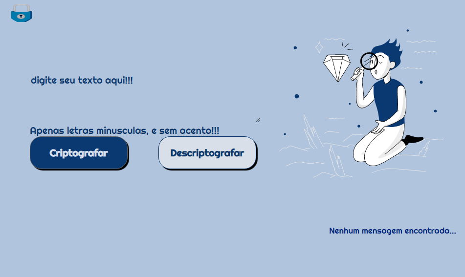
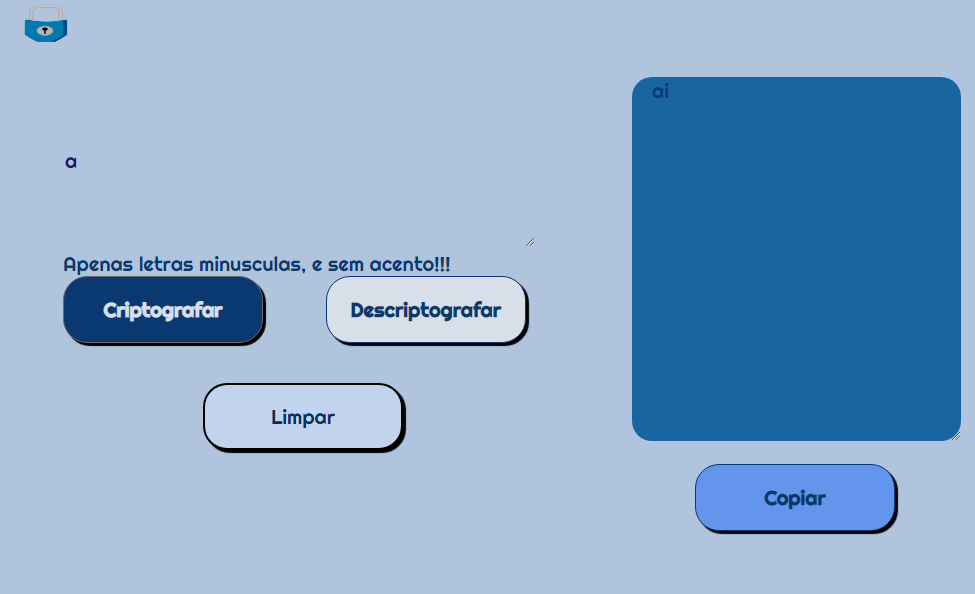
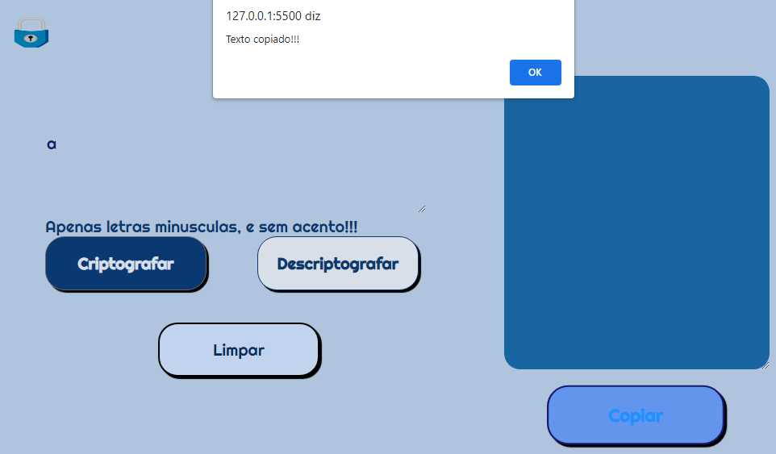

# Encriptador de texto, desafio Alura

Já pensou ter uma página que transforma sua mensagem, em um texto codificado?

Isso que o desafio da Alura nos trás.

## Nesse projeto
Embarcamos na construção de um decodificador de texto, que transforma as palavras em um código criptografado.

### Aceita apenas letras minúsculas
### Carrega a mensagem criptografada em uma outra caixa de texto

### Tem botões para a função criptografar, descriptografar e limpar

### Não aceita para encriptação, letras com acento
# Rascunho do JS

// 1 Quando digitar letra, subsitutir por código
//As "chaves" de criptografia que utilizaremos são:
//Se a letra "e" substitua por "enter"
//Se a letra "i" é substitua por "imes"
//Se a letra "a" é substitua por  "ai"
//Se a letra "o" é substitua por "ober"
//Se a letra "u" é substitua por "ufat"
// function letraCripto (letra){
//  document.write(letra);   
//}

// se letra igual a..., substitua por....

